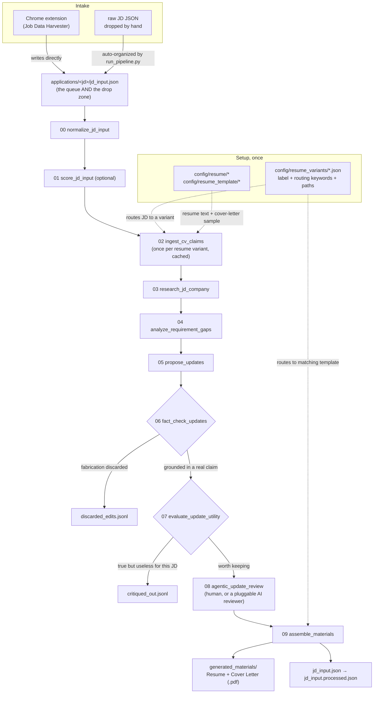

# CVTailor

Turns a job description into a tailored resume + cover letter, through
a pipeline of small scripts with a fact-check gate and one interactive
human review — built to run many JDs back-to-back, not just one at a
time.

## Folder structure

```
jobs/
├── config/                          your inputs — set these up once
│   ├── resume/<your_resume>.pdf         (one file, or several -- see "Resume variants" below)
│   ├── resume_template/<template>.docx  (one file, or several -- matched to resume/ variants)
│   ├── resume_variants/<variant>.json   defines each resume variant: label, resume/template
│   │                                     filename, routing keywords -- see "Resume variants" below
│   ├── cover_letter_sample/<sample>.txt (exactly one file)
│   ├── cover_letter_template/<template>.docx (optional — see below)
│   ├── credentials/                     API key placeholders — see *.txt.example
│   └── applicant_info.json              {"name": ..., "email": ..., "phone": ...}
├── applications/                    the queue AND the drop zone — see below
│   ├── _shared/                     resume/cover-letter ingest, one subfolder per resume variant
│   ├── archived/                    permanent "done" state, see src/controls/py_pipeline_store_archive.py
│   └── <jd_filename>/               per-JD intermediate artifacts + audit trail
│       └── generated_materials/     the actual resume/cover-letter/follow-up output --
│                                     kept separate from the audit-trail JSON also in this folder
├── logs/                            JSONL audit log, one line per stage per run
├── contracts/                       the JD JSON schema, for the Chrome extension
├── docs/                            QUICKSTART.md, FULL_PIPELINE_EXPLAINER.md, DEFINITION_OF_DONE.md, GOALS_BENCHMARKS.md, setup/
├── extension/
│   ├── chrome/                      the "Job Data Harvester" Chrome extension
│   └── native_host/                 optional native-messaging bridge (skips the download-and-drop step)
├── src/
│   ├── core/                        schemas, batch_common, LLM dispatch, docx utils, py_run_stage, py_logger
│   ├── adapters/                    harvester_adapter.py (extension payload -> JDInput)
│   ├── sourcing/                    job-scoring engine (stage 1)
│   ├── stages/                      the 10 pipeline stages (00-09), each a standalone script
│   ├── ai_wrappers/                 pluggable stage-8 reviewer: human CLI vs. an AI backend
│   ├── prompt_library/              every system prompt as its own template file
│   ├── checkpoints/                 status/precheck/summary/verify — read-only, non-destructive
│   ├── controls/                    reset/archive/assemble/mark-applied/open-urls — act on applications/
│   └── util/                        one-off maintenance tools + py_answer_question.py
├── pipeline.yaml                    top-level config: review assignee, credential pointers, etc.
├── run_pipeline.py                  batch prepare (stages 0-7), or single-JD end-to-end mode
└── cvtailor_score.py                thin wrapper backing the `score-job` console command
```

See `docs/QUICKSTART.md` for copy-pasteable everyday commands, and
`docs/FULL_PIPELINE_EXPLAINER.md` for a condensed, step-by-step command
reference — this document covers the "why," those cover the "what to
type."

## Architecture at a glance



Two gates sit between "an edit was proposed" and "an edit reaches your
resume": stage 6 discards anything not grounded in the claims ledger
(catches fabrication), stage 7 discards anything true but not useful
*for this specific JD* (catches irrelevant padding). Stage 8 is the
only stage that stops for you — everything before and after it runs
unattended across a whole batch.

## The pipeline (10 stages, 00-09)

```
00. normalize_jd_input      JD json                -> jd_input.json          (validates untrusted input)
01. score_jd_input          jd_input                -> score_report.json      (optional, non-blocking — decides resume variant)
02. ingest_cv_claims        resume + cover sample   -> claims_ledger.json, style_profile.json
03. research_jd_company     jd_input + claims       -> company_brief.json     (LLM + web search)
04. analyze_requirement_gaps  jd_input + claims     -> edit_brief.json
05. propose_updates         ledger + brief + jd     -> candidate_edits.json   (constrained to the ledger)
06. fact_check_updates      edits + claims_ledger   -> verified_edits.json,   (fact-check gate — discards
                                                        discarded_edits.jsonl    fabrications before you see them)
07. evaluate_update_utility  verified_edits + jd    -> critiqued_edits.json,  (utility gate — cuts edits that are
                                                        critiqued_out.jsonl      true but useless for THIS job)
08. agentic_update_review   critiqued_edits.json    -> review_decisions.json  (interactive — the only manual step,
                                                                                or delegate to an AI reviewer via
                                                                                src/ai_wrappers/)
09. assemble_materials      decisions + template    -> generated_materials/{Company} - {Role} - {Name} - Resume/Cover Letter.*
```

Every stage script lives at `src/stages/py_stageNN_<name>.py` and is a
standalone CLI — stages never import each other, they only agree on
the file shapes above (see `src/core/schemas.py`).

## Batch workflow — the normal way to run this

**Setup, once:**
1. Drop your resume into `config/resume/`, your resume docx template into
   `config/resume_template/`, and a sample cover letter (plain text) into
   `config/cover_letter_sample/`.
2. Create `config/applicant_info.json` (copy `config/applicant_info.example.json`
   and fill in your name — email/phone are optional).
3. `pip install -r requirements.txt` and `$env:ANTHROPIC_API_KEY = "sk-ant-..."`
   (or copy `config/credentials/anthropic_key.txt.example` — see that file's
   own comments for current status).
4. `python src/checkpoints/py_pipeline_precheck.py` — checks all of the
   above before you spend anything.

**Per batch of applications:**
```bash
# 1. Get JDs into applications/ -- the Chrome extension writes straight into
#    applications/<app_id>/ on its own; for anything else, drop a raw JD JSON
#    straight into applications/ (any filename) and step 2 below organizes it
#    into its own subfolder automatically. applications/ itself is the queue
#    AND the drop zone, no separate config folder anywhere.

# 2. Prepare everything pending -- runs stage 2 (resume-variant ingest) and
#    stages 3-7 for every JD that isn't already verified. If config/resume/
#    has more than one resume (e.g. a "Backend" and a "Full Stack" variant),
#    each JD is routed to whichever one actually matches its real
#    requirements/responsibilities.
python run_pipeline.py --dry-run   # free — validates wiring, makes no API calls
python run_pipeline.py             # for real

# 3. Review each one that's ready — run with no arguments and it auto-discovers
#    every JD ready for review, walking through them one after another (still
#    interactive per edit — this is the one step that needs your actual judgment)
python src/stages/py_stage08_agentic_update_review.py

# 4. Assemble everything you've reviewed — converts to PDF, writes into
#    applications/<jd_name>/generated_materials/, marks each JD processed in
#    place (jd_input.json -> jd_input.processed.json)
python src/controls/py_pipeline_assemble.py

# Check where everything stands at any point:
python src/checkpoints/py_pipeline_status.py
```

One JD failing during prepare or assemble doesn't stop the batch — failures
are collected and reported at the end, and already-succeeded JDs are
automatically skipped on re-run (use `--force` to redo one on purpose).

### Resume variants

`config/resume/` and `config/resume_template/` can each hold more than
one file — useful if you're applying to genuinely different flavors
of role (e.g. a Backend-leaning resume vs. a Full Stack one, or a
third AI Engineer variant) and want each JD routed to the matching one
automatically instead of always using a single resume regardless of
fit.

Which resumes exist, which template each one assembles into, and what
routes a JD to it are entirely defined by `config/resume_variants/*.json`
— one file per variant, nothing hardcoded in the pipeline itself. Copy
one of the shipped `*.example.json` files there to a real `.json` file
and fill it in:

```json
{
  "label": "Full Stack",
  "resume": "Your Full Stack Resume.pdf",
  "resume_template": "Your Full Stack Resume.docx",
  "default": false,
  "keywords": ["react", "angular", "frontend", "..."]
}
```

- `resume` / `resume_template` are filenames inside `config/resume/` /
  `config/resume_template/` — `resume_template` is optional; omit it
  on every variant to share one template across all of them.
- `keywords` are checked (case-insensitive substring match) against
  each JD's `requirements_raw` + `responsibilities_raw` first, falling
  back to the full description text only if those are empty. Whichever
  non-default variant racks up the most distinct keyword hits wins.
- Exactly one variant must be marked `"default": true` — the fallback
  used when nothing matches (usually your most general resume). It
  doesn't need any `keywords` of its own.

Adding a third variant (say, an AI Engineer resume) is just dropping
in a fourth `.json` file with its own keywords — no code change. If
you only keep one resume, its config still needs `"default": true`,
but `keywords` can be left empty since there's nothing to route
between.

### Why stage 2 only runs once per batch

`claims_ledger.json` and `style_profile.json` come from your resume and
cover letter sample — neither depends on any particular JD. Running
stage 2 fresh for every JD in a batch would just be N redundant API
calls for the same result, so `run_pipeline.py` runs it once into
`applications/_shared/` and reuses it, re-running automatically (hash-
checked) only if you actually change your resume or cover letter.

### Cover letter voice extraction — checked for content leakage

`style_profile.json` is supposed to capture VOICE only (sentence
rhythm, tone, structural habits) from your sample cover letter, never
its content. That's not just about avoiding company-name mix-ups —
this file sits entirely outside the claim-verification system that
governs everything else in the pipeline. Stage 5 can read it, and
stage 6 never checks anything against it, only against
`claims_ledger.json`. So the real test isn't "is this specific to the
company the sample letter targeted" — it's "is there any real,
checkable fact here at all," full stop. A true fact about your own
past employer is just as much a problem sitting in this file as a
competitor's name would be, because nothing fact-checks it here; if
it's worth keeping, it belongs in the resume claims ledger instead,
where it gets a claim_id and goes through generate → verify → review
like everything else.

So stage 2 runs a second pass after extraction: a stricter prompt
(explicit hard rules against proper nouns, real numbers, and against
`signature_phrases` turning into verbatim lifted sentences) followed
by an independent audit call that checks the extraction against the
original letter and flags any concrete, checkable content — regardless
of whose history it describes. The audit is required to return the
exact, verbatim offending list entry (not a description of it), which
lets `py_stage02_ingest_cv_claims.py` auto-redact the flagged entries
deterministically — no LLM guessing, no manual JSON editing for the
common case — and then re-runs the check once against the redacted
profile to confirm it's actually clean rather than trusting the
redaction blindly. Only if something's still flagged after that single
retry does it fall back to writing `style_profile_LEAK_WARNING.json`
and printing a loud warning — and `py_pipeline_status.py` will keep
surfacing that warning at the top of its output until you've reviewed
and hand-edited `applications/_shared/style_profile.json` (it's just
JSON — safe to edit directly).

Extraction is explicitly allowed to describe a recurring rhetorical
move (an opener, a transition, a closing move) using bracket
placeholders — `[entity]`, `[metric]`, `[outcome]` — in place of the
real specifics. That's the intended, correct form of abstraction, not
something the leak-check should be suspicious of; the audit is
instructed to judge only whether a real name, number, or fact is still
literally present, not whether a sentence's shape resembles something
specific that's since been abstracted away.

This is a safeguard, not a substitute for looking at your actual sample
letter first — see "if your sample cover letter is weak" below.

### If your sample cover letter is weak

The leak check only catches employer-specific *content* slipping
through — it says nothing about whether the underlying voice is one
worth imitating. Garbage in, garbage out still applies: if the sample
is a weak draft, `style_profile.json` will faithfully encode a weak
voice. Since it's plain JSON, `applications/_shared/style_profile.json`
is safe to open and hand-edit directly after the first `run_pipeline.py`
run — touch up `tone_descriptors`/`structural_notes` if they don't
match how you actually want to sound, without needing to re-run
extraction. And stage 8 still shows you the real generated text for
every cover letter sentence before you approve it, so a weak voice
profile shows up there too, not just in the cache.

### Why a JD only gets marked processed after assembly

Every JD lives at `applications/<jd_name>/` from the moment it's
captured — that folder IS the queue, not a separate tracking file. An
unrenamed `jd_input.json` inside it means "still pending in some way"
— could be not started, prepared but not reviewed, or reviewed but not
assembled. It only becomes `jd_input.processed.json` once real output
exists in `generated_materials/`, and only
`src/controls/py_pipeline_assemble.py` does that rename, right after
writing that output. If assembly fails partway through, the file stays
`jd_input.json` — nothing gets silently lost track of.

### Re-processing a JD

If it's still live (not yet processed, not archived): just re-run
`run_pipeline.py --force` (or the relevant later phase) —
`applications/<jd_name>/generated_materials/` gets overwritten in
place, matching the same identifier.

If it's already been marked processed: use `src/controls/py_pipeline_reset.py`
to reset it:

```bash
python src/controls/py_pipeline_reset.py --jd <app_id>      # one JD
python src/controls/py_pipeline_reset.py --all              # every live JD
```

By default this undoes the processed marker and clears the generated/
verified/reviewed artifacts (edit_brief.json, company_brief.json,
candidate_edits.json, verified_edits.json, verification_report.json,
review_decisions.json) plus `generated_materials/` — a requeue almost
always means something changed and you want a clean run, and leaving
old `review_decisions.json` around would sit there with `edit_id`s
that won't match anything freshly generated. `jd_input.json` itself is
never touched -- there's no need to re-run stage 0. Pass
`--keep-artifacts` if you specifically want to keep the old working
state around (e.g. for comparison) and just undo the processed marker.

### Permanently done with a JD

Requeuing only ever touches live applications — `py_pipeline_reset.py`
can't pull something back out of `archived/`. For a JD you're truly
finished with (interviewed, rejected, withdrawn, whatever) and never
want resurfacing via a `--all` reset, move it to `archived/` instead:

```bash
python src/controls/py_pipeline_store_archive.py --jd <app_id>
python src/controls/py_pipeline_store_archive.py --all
```

This moves the whole `applications/<app_id>/` folder (`generated_materials/`
and all) into `applications/archived/<app_id>/` as one consolidated
unit, keeping the same `app_id` name — no date-stamping, since the
folder's own `LastWriteTime`/git-free existence already tells you
when it landed there if you need that. If `archived/<app_id>/`
already exists (the same JD somehow archived twice), the move fails
loudly with a clear error rather than silently overwriting the
earlier copy.

`archived/` is a dead end by design — nothing in this pipeline ever
reads from or writes to it except `py_pipeline_store_archive.py` itself.

Already sent it? `src/controls/py_post_pipeline_store_applied.py` is
the related, more specific tool for that -- moves into
`applications/archive/{applied,cut_off,revisit,test}/` by prefix match,
with its own move log. See its own docstring.

### `--dry-run` and what it actually validates

Stages 2-5 write clearly-labeled **placeholder** files in dry-run mode
(so the whole chain can be validated for free, all the way through
argument-passing, schema loading, and file paths) but make no real API
calls. Stage 6 is the one exception — it prints what it *would* do but
writes nothing, since `verified_edits.json` is what you review next,
and a fake placeholder there risks getting mistaken for real content
and approved by accident. A `--dry-run` batch run is genuinely free and
validates real wiring; it just can't validate what the actual research
or edits would look like.

## LLM provider — LM Studio (local) by default, cloud as an explicit opt-in

CVTailor defaults to a **local model served by LM Studio** — no API
key, no cloud spend, nothing leaves your machine, unless you
explicitly opt into a cloud provider with `--provider claude` or
`--provider gemini`. This is deliberate: a stray run should never
spend real API budget by accident. Only one provider talks to your
data in any given run, never more than one.

**Using LM Studio (the default, no flag needed):** see
`docs/setup/LM_STUDIO.md` for setup, and `docs/setup/LOCAL_MODELS.md`
for what to look for in a model.

Stage 3 (company research) has no built-in web search the way Claude's
`web_search` tool or Gemini's `google_search` grounding do, so on the
LM Studio path it runs its own targeted DuckDuckGo searches (via the
`ddgs` package) up front and hands the results to the model as context
— falling back to a training-knowledge-only best-effort brief, with a
clear warning, only if search genuinely fails (network down, package
missing). If you still want Claude/Gemini's deeper, provider-native
research for a given application, `--provider claude`/`--provider gemini`
for stage 3 specifically still works even while using LM Studio for
everything else.

**Opting into a cloud provider:**
```bash
export CVTAILOR_LLM_PROVIDER=claude   # standing default, or:
python run_pipeline.py --provider claude   # one-off override
```
Every stage script and `run_pipeline.py` accept `--provider lmstudio|claude|gemini`,
defaulting to `$CVTAILOR_LLM_PROVIDER` (itself defaulting to `lmstudio` if unset).
Switching providers automatically triggers a fresh stage-2 ingest rather than
reusing a different provider's cached extraction.

**API keys:** none needed for LM Studio. `ANTHROPIC_API_KEY` for Claude,
`GEMINI_API_KEY` for Gemini — only needed if you explicitly switch (or
for `src/ai_wrappers/py_stage08_reviewer_gemini.py`, the Agent reviewer
backend, which always uses Gemini for generation). `py_pipeline_precheck.py`
checks whichever one your active provider needs. See `pipeline.yaml`
and `config/credentials/*.txt.example` for the credential-pointer
scaffold.

**Model tiers** (`src/core/llm_dispatch.py` — the one place to update
if a provider ships a new model generation and an old one gets
deprecated):

| tier | used by | Claude | Gemini | LM Studio |
|---|---|---|---|---|
| cheap | stage 2 (extraction) | `claude-haiku-4-5-20251001` | `gemini-3.5-flash-lite` | whatever's loaded |
| standard | stages 2, 3, 5 | `claude-sonnet-5` | `gemini-3.6-flash` | whatever's loaded |
| reasoning | stage 5 (generation) | `claude-opus-4-8` | `gemini-3.1-pro` (preview) | whatever's loaded |

LM Studio has no real cheap/standard/reasoning distinction the way the
cloud providers do — a local setup typically has one model loaded at a
time, so all three tiers resolve to it. Set `LMSTUDIO_MODEL` to pin an
exact model id if you're serving more than one and want to be explicit;
otherwise the first model LM Studio reports via `/v1/models` is used —
**and with Just-In-Time model loading enabled in LM Studio, that
endpoint lists every downloaded model, not just what's active in the
UI**, so "first" is arbitrary catalog order, not necessarily the one
you meant to use. Set `LMSTUDIO_MODEL` explicitly whenever you have
more than one model downloaded, rather than relying on catalog order.

**Stage 3's research is architecturally different per provider**, not
just a different model string: Claude can combine web search with
forced structured output in a single call. Gemini's `google_search`
grounding tool can't reliably be combined with `response_schema` in the
same call across model generations (it's thrown hard 400 errors on
some), so the Gemini path always uses two calls — search and write
free-text notes, then structure those notes into the schema with no
tools involved. Costs one extra call vs. Claude for that stage; it's
the reliable choice regardless of which Gemini model generation is
current when you run this.

**All calls retry** with exponential backoff on rate limits / transient
errors, regardless of provider. Claude calls also retry when the model's
tool call succeeds but doesn't match the expected schema (e.g. a
missing required field) — rather than crashing immediately, the bad
response is fed back to the model with the validation error and one
corrective retry is attempted before giving up (see
`_call_claude_structured` in `src/core/llm_dispatch.py`).

## The Chrome extension contract

Stage 0 accepts either the canonical `JDInput` schema or the Job Data
Harvester extension's own 13-key schema (JobTitle/Company/Location/
WorkplaceType/Salary/EmploymentType/Department/CompanyDescription/
RoleDescription/Benefits/Responsibilities/Requirements/NiceToHave),
auto-detected and normalized via `src/adapters/harvester_adapter.py`.
Only `full_description_text` (or the harvester equivalent) is a hard
requirement — everything else (salary breakdown, remote type,
requirements/responsibilities/nice-to-have arrays) is best-effort
enrichment.

- **Machine-readable contract**: `contracts/jd_input.schema.json` — hand this to whoever's building an extension
- **Example payload**: `contracts/jd_input.example.json`
- Regenerate the schema if `JDInput` changes: `python -c "import sys; sys.path.append('src/core'); import json,schemas; json.dump(schemas.JDInput.model_json_schema(), open('contracts/jd_input.schema.json','w'), indent=2)"`
- **Optional native-messaging bridge**: `extension/native_host/` skips the
  download-and-drop step entirely -- see its own README.md for setup.

### Gap-analysis weighting

Stage 4 treats `requirements_raw`, `responsibilities_raw`, and
`nice_to_have_raw` — when the extension provides them as pre-parsed
arrays — as the primary, authoritative source for what counts as a
"requirement" during gap analysis. `requirements_raw` and
`responsibilities_raw` are weighted equally (what a role involves day
to day is as much a fit signal as its stated requirements bar);
`nice_to_have_raw` is primary-tier but lower priority. The prose in
`full_description_text` (role/company description) is context, not a
coverage-scoring input — a generic mission-statement sentence
shouldn't outweigh or substitute for an explicit requirement, though
genuinely specific technical detail in the prose (a particular stack,
a particular team's real mandate) still counts. If the extension
doesn't provide the structured arrays, stage 4 derives them from the
prose itself, applying the same weighting to whatever it finds.

Two things the extension doesn't (and structurally can't) capture,
since it runs fully on-device with no network calls: `source_url`
(pass `--source-url` manually if you want it in research citations)
and `scraped_at` (stamped at adapter-run time instead).

**Security note**: JD text is scraped from the open web, so stages 3-4
wrap it with an explicit "this is data, not instructions" preamble
(`UNTRUSTED_CONTENT_PREAMBLE` in `src/core/llm_dispatch.py`) before it
goes into any prompt — worth keeping if you extend those prompts, since
a scraped job posting is exactly the kind of content that could carry
hidden text aimed at whatever reads it next.

## Docx editing approach

`py_stage09_assemble_materials.py` uses `docx_replace_text()` (in
`src/core/docx_utils.py`) rather than a naive `paragraph.text = ...`
swap, since Word fragments visible text across multiple runs and a
plain string replace silently loses formatting or just fails to match.
The helper walks runs, writes the replacement into the first run touched
(preserving its formatting), and clears the matched portion out of any
runs after it. `iter_all_paragraphs()` walks table cells too,
recursively — a lot of resume templates use tables for column layout.

Matching normalizes curly vs. straight quotes before comparing text
(a 1:1 character substitution, so match indices stay valid against the
original) — found via a real failure: an edit approved during stage 8
silently never applied because the source resume and the separately-
maintained template docx used different quote styles for the same
text. Worth knowing if you keep `config/resume/` and
`config/resume_template/` as genuinely separate files rather than one
derived from the other — any textual drift between them, not just
quotes, can break matching the same way.

Unmatched edits (original text not found verbatim in the template) are
printed as warnings distinguishing *why* — no `original_text` at all
(should have been caught upstream by stage 6) vs. text genuinely not
found (whitespace/quote drift) — rather than one misleading catch-all
message.

**PDF conversion**: `src/controls/py_pipeline_assemble.py` converts the
assembled docx files to PDF via `docx2pdf` (MS Word COM automation —
Windows/Mac only, requires Word installed). Falls back to shipping the
`.docx` if conversion isn't available; use `--keep-docx` to keep both
(the default).

### Cover letter template (optional)

By default, the cover letter is built from scratch with generic
Calibri styling — functional, but visually unrelated to your resume.
Drop a `.docx` into `config/cover_letter_template/` with these literal
placeholder strings and it's used instead, inheriting whatever fonts/
margins/styling that template already has:

```
{{APPLICANT_NAME}}   {{CONTACT_LINE}}   {{DATE}}
{{ROLE_TITLE}}   {{COMPANY}}   {{BODY}}
```

`{{BODY}}` is special — it expands into one real paragraph per
approved cover-letter edit (via python-docx's native
`insert_paragraph_before`, not line breaks inside one paragraph),
copying that placeholder's own font/size/bold onto each new paragraph,
then removing the placeholder itself. Every other placeholder is a
plain in-place text substitution via `docx_replace_text()`. No
template present → falls back to the original from-scratch builder
automatically; nothing breaks if you don't set this up.

The simplest way to get a visually-matched template: duplicate your
actual resume docx, strip out the experience content, keep the header/
name/contact styling, and drop in the placeholder lines above — that
inherits your resume's real fonts and margins directly rather than
guessing at them.

### Page limits — 2-page resume, 1-page cover letter (both configurable)

**Important limitation**: the pipeline can only *reword* resume bullets
in place — it can't remove, reorder, or insert them (stage 5 is
explicitly restricted to this, and stage 6 discards anything that
isn't, before you ever see it at review — see "Docx editing approach"
above for why). That means the number of lines in your final resume is
entirely determined by `config/resume_template/*.docx` itself; no
wording change shortens it. If your template runs to three pages, it'll
keep running to three pages regardless of how the bullets are worded.

The cover letter is different — it's a baseline-swap document, and
stage 5's prompt (rule 14) explicitly keeps most edits page-neutral in
length, so it shouldn't drift over one page from edits alone. The two
edits that are allowed to run longer (the mandatory company-specific
paragraph and closing sentence) are exactly the ones most likely to
occasionally need it.

What `src/controls/py_pipeline_assemble.py` does automatically for
**both** documents, each against its own target, is typography
compression — margins, paragraph spacing, and (only at the most
aggressive level) body-text font size — applied progressively and only
as far as needed, checked against the actual rendered PDF page count
after each attempt (`get_pdf_page_count()`), not guessed at:

```bash
python src/controls/py_pipeline_assemble.py                            # defaults: resume 2 pages, cover letter 1 page
python src/controls/py_pipeline_assemble.py --resume-max-pages 1        # if you want a strict one-page resume instead
python src/controls/py_pipeline_assemble.py --cover-letter-max-pages 2  # if your letter genuinely needs two
python src/controls/py_pipeline_assemble.py --max-page-fit-level 0      # disables compression entirely, for either document
```

A document already at or under its target is left completely alone —
no compression attempted, no PDF re-rendered a second time.

Compression scales *relative to your template's current margins*, with
a 0.35in floor — not fixed absolute targets, which would actually
*widen* margins on a template that's already tighter than the target.
Header/name text is protected from the font-size step by size
(anything above 14pt is left alone), so only body text ever shrinks,
and only at the final, most-aggressive level.

**Be realistic about how much this can do**: if your template already
uses tight margins and a small body font (many resume templates do,
to fit more content), there isn't much compression headroom left, and
a couple of pages' worth of excess content won't compress down to the
target through typography alone. If `py_pipeline_assemble.py` reports
it's still over the target page count at maximum compression, that's a
genuine signal the document has more content than fits — the reliable
fix at that point is trimming the template (or, for the cover letter,
checking whether an edit grew a paragraph more than it should have),
not more aggressive typography.
